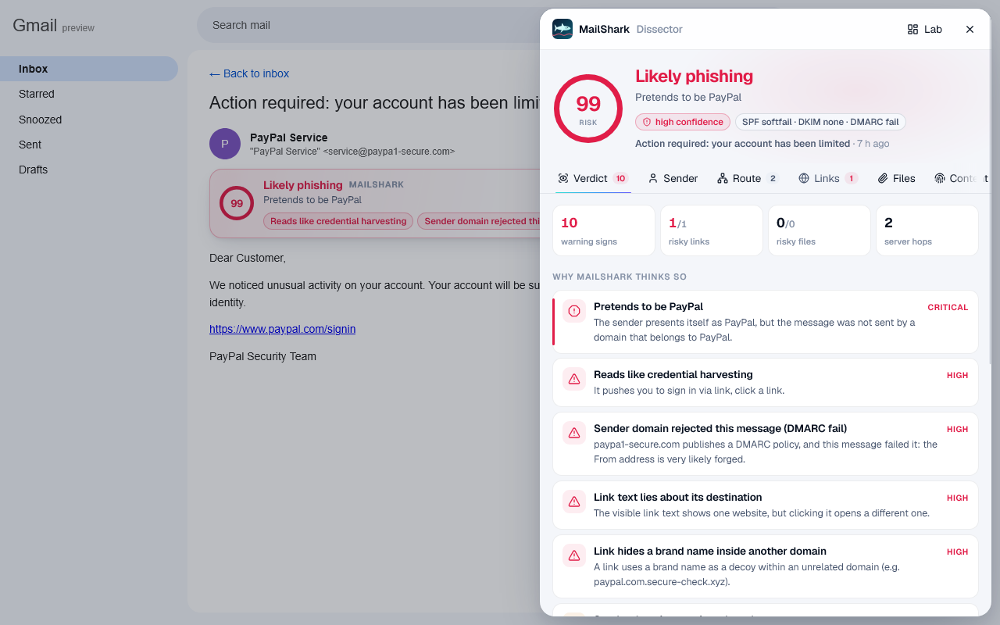
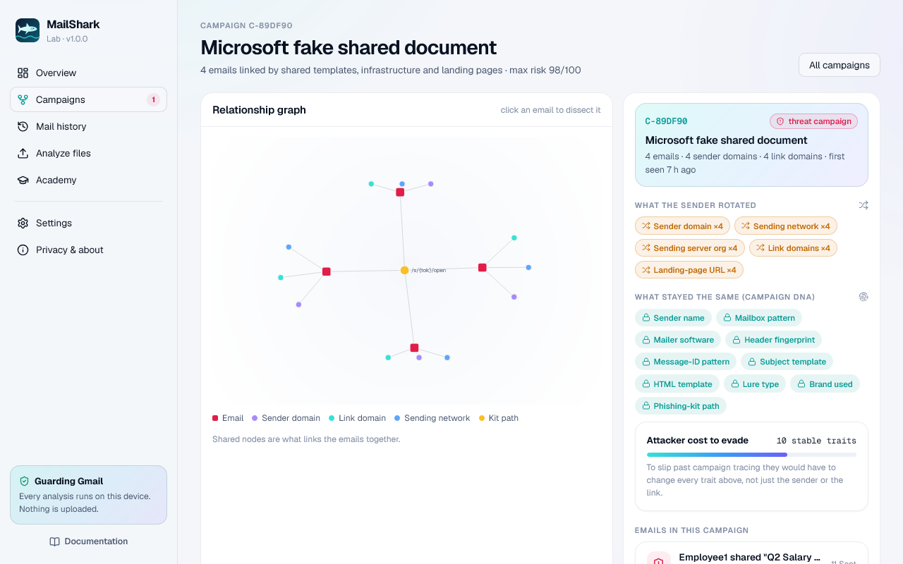

<p align="center">
  
</p>

<h1 align="center">MailShark</h1>

<p align="center"><b>Phishing forensics for Gmail. Every email dissected on your device, and campaigns traced across your inbox.</b></p>

<p align="center">
  Firefox 140+ · Zen, Floorp, LibreWolf and other Gecko browsers · MIT
</p>

<p align="center">
  
</p>

---

Most phishing protection answers one question: *"is this link on a blocklist?"* Attackers answer it by rotating domains, senders and file hashes for every wave. MailShark reads the whole message, the way a forensic analyst would:
- the delivery route
- authentication results
- sender identity
- links, HTML and attachments
- the psychology of the text

It explains what it finds in plain language. It also remembers what it has seen, so different-looking emails from the **same campaign** are linked even after their domains, senders, links and files have been rotated.

Everything runs inside your browser. MailShark has no server and no account, and it sends no data anywhere.

## What you get

**In Gmail**
- **Verdict banner** on every email you open: *Safe*, *Suspicious* or *Dangerous*, with the top reasons in one line.
- **Inspector drawer:** a packet-analyser-style dissection in eight panes:
  - Verdict
  - Sender
  - Route (every Received hop, with the trusted hand-off point)
  - Links (real destinations, look-alikes, redirects, QR codes)
  - Files (true file type, macros, archives, hashes)
  - Content (intent, urgency, hidden text)
  - Campaign
  - raw Source
- **Link guard:** clicking a dangerous link stops at a MailShark screen that shows where the link really leads.
- **Inbox radar:** verdict badges in the message list, including for emails you have not opened yet.

**In the MailShark Lab** (the add-on's own page)
- **Overview** of threats caught, campaigns and top impersonated brands.
- **Campaigns:** an interactive graph of related emails. It shows what each campaign kept constant (its "DNA") and what it rotated.
- **History** of every dissected email, with search and filters.
- **Analyze:** drop `.eml` or `.mbox` files (Thunderbird, Apple Mail, Outlook, Google Takeout) for offline forensics.
- **Academy:** ten short lessons on the tactics MailShark detects, from look-alike domains to QR-code phishing.
- **Export** as JSON, CSV, Markdown or STIX 2.1 for incident reports and threat-intel platforms.

## What the engine checks

| Layer | Examples |
|---|---|
| Authentication | SPF, DKIM, DMARC and ARC read from the receiving server's trusted `Authentication-Results`; alignment; forged results inserted by the sender |
| Route | Trusted hand-off hop, origin IP, hops the sender could have forged, date skew, bulk-mailer and ESP fingerprints |
| Sender | Display-name brand impersonation, look-alike and homoglyph domains, Reply-To and Return-Path divergence, lures that name your own organisation, role names ("IT Helpdesk") |
| Links | Text/destination mismatch, IP hosts, redirects and shorteners, punycode, brand names embedded in hostnames, executable downloads, QR codes inside images |
| HTML | Forms, scripts, hidden text, image-only bodies padded with filler, invisible and zero-width characters |
| Attachments | Real type vs extension, double extensions, macros in Office files, archives (listing their contents), HTML smuggling, password-protected archives with the password in the body |
| Content | Credential, payment, gift-card, crypto, MFA, delivery, tax, job, extortion, call-back and BEC lures in several languages; urgency; fake replies (`RE:` with no thread) |
| Threat intelligence | Public phishing and malware domain lists, compiled to Bloom filters and checked locally |
| Campaign | MinHash and SimHash of the text, HTML skeleton, URL and phishing-kit path templates, Message-ID and header-order signatures, ESP campaign IDs, attachment structure |

Every finding carries an explanation and a weight. The score comes from the evidence and can be traced back to it, rather than from an opaque model.

## Accuracy

Measured on 16,228 real emails from the Nazario phishing corpus, phishing_pot and SpamAssassin:

| | |
|---|---|
| Nazario phishing 2015–2025 flagged | **85.7%** |
| Legitimate mail flagged (held-out) | **0.26%** |
| Precision (all messages) | **99.55%** |
| Median analysis time | **6.8 ms** |

Methodology, the tuning/held-out split and the limitations are in [docs/ACCURACY.md](docs/ACCURACY.md).

<p align="center">
  
</p>

## Privacy

- **Mail access.** MailShark reads a message's original source from Gmail in your own session, exactly what *Show original* shows. It analyses it locally and stores only the results, in the add-on's IndexedDB.
- **Network requests.** The only other one downloads public threat lists, without cookies, and can be turned off.
- **No collection.** No telemetry, analytics or accounts.

Full details are in [PRIVACY.md](PRIVACY.md).

## Install

- **Firefox, Zen, Floorp, LibreWolf:** install from [addons.mozilla.org](https://addons.mozilla.org/firefox/addon/mailshark/) once the listing is live.
- **From source:** `npm ci && npm run build`, then load `dist/firefox/manifest.json` from `about:debugging` → *This Firefox* → *Load Temporary Add-on*.

Open Gmail and then any email. MailShark dissects it automatically.

## Develop

```bash
npm ci
npm run build          # dist/firefox
npm run watch          # rebuild on change
npm run verify         # typecheck, unit + end-to-end engine tests, build, addons-linter
npm run package        # artifacts/mailshark-<version>.zip + source zip, linted
node scripts/preview.mjs   # UI preview on a Gmail mock at http://localhost:5178
```

- **Real-browser test:** `python tests/e2e_firefox.py --browser <firefox or zen binary>` loads the add-on into Gecko with Selenium and checks the full flow on a local Gmail mock.
- **Reproducible build:** see [docs/BUILDING.md](docs/BUILDING.md).
- **Architecture:** see [docs/ARCHITECTURE.md](docs/ARCHITECTURE.md).

## Repository

| Path | |
|---|---|
| `engine/` | The forensic engine (TypeScript, no DOM or network), with unit and end-to-end tests |
| `extension/` | The Firefox add-on: background page, Gmail content script, Lab, popup, welcome, design system |
| `fixtures/eml/` | Test emails (synthetic, safe) |
| `feeds/` | Threat-feed compiler (Python), run daily by GitHub Actions and published to the `feeds` branch |
| `lab/` | **MailShark Lab**, the Python forensic companion. It covers acquisition with chain of custody, campaign clustering, rotation experiments and HTML case reports. See [lab/README.md](lab/README.md). |
| `scripts/` | Build, packaging, preview harness and accuracy evaluation |
| `tests/` | Real-Gecko end-to-end test |

## Licence

MIT © 2026 Jyothir. Bundled third-party components are listed in [THIRD_PARTY_NOTICES.md](THIRD_PARTY_NOTICES.md).
