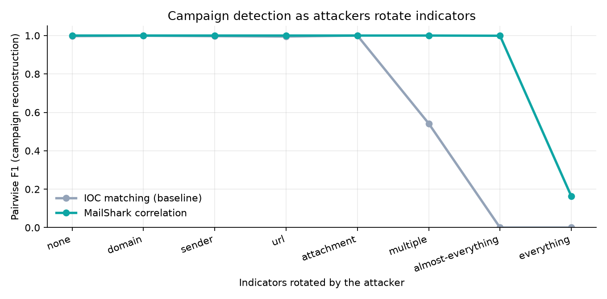

# MailShark Lab: Phishing Campaign Tracer

> **Course problem #23: Phishing Campaign Tracer.** Cluster related phishing emails using header metadata, URLs and attachment hashes to trace a common origin.
> **Tools:** Python, pandas, hashlib. **Deliverable structure:** Acquisition → Analysis → Validation → Report.

MailShark Lab is the forensic and research companion to the MailShark browser extension. It takes a pile of `.eml` files or `.mbox` archives and:
- groups the messages into **campaigns**
- explains what each campaign kept constant and what it rotated
- traces each campaign's infrastructure

It then proves, on labelled data, that this beats traditional indicator matching.

## The problem

Attackers rarely send one identical email. They run **campaigns**, rotating sender addresses, domains, IPs, URLs and attachment hashes between messages so that each email looks new. A detector that asks *"have I seen this exact IOC before?"* sees a hundred strangers.

MailShark Lab asks a different question: **"are these different-looking emails manifestations of the same operation?"** It compares messages on layers attackers rarely change:
- templates
- mailer software and header order
- phishing-kit URL paths
- attachment structure and fuzzy hashes
- lure type

This is **similarity over equality**.

## Pipeline

| Stage | Module | What happens |
|---|---|---|
| **Acquisition** | `acquire.py` | Reads `.eml`, folders and `.mbox`. Every message and every container file is hashed (SHA-256, SHA-1, MD5) at intake into a chain-of-custody manifest. Originals are never modified. |
| **Analysis: extract** | `extract.py` | Standard-library `email` parsing. Extracts: From/Reply-To/Return-Path; the `Received` chain and origin IP; SPF/DKIM/DMARC; DKIM selectors; ESP (bulk-mailer) campaign IDs; the HTML skeleton; URLs with anchor text; attachments hashed with `hashlib` plus `ssdeep` fuzzy hashes and zip listings. Nothing is rendered or executed. |
| **Analysis: normalize** | `normalize.py` | `pandas` tables. Converts hosts to registrable domains (Public Suffix List, offline); per-recipient URL tokens to URL templates and path templates; subjects to subject templates; bodies to MinHash sketches. Also records the lure type. |
| **Analysis: cluster** | `cluster.py` | Finds candidates through an inverted index of stable traits plus MinHash-LSH. Scores pairs on seven layers (content, URLs, attachments, infrastructure, sender, semantics, timing) and joins campaigns with a union-find over the similarity graph (`networkx`). Also implements the **exact-IOC baseline**. |
| **Analysis: trace** | `trace.py` | Per campaign: the **invariants** (campaign DNA), the **rotated** attributes, origin IPs and networks, the timeline, and the *attacker cost to evade*. |
| **Validation** | `synth.py`, `evaluate.py` | Labelled synthetic campaigns at 8 rotation levels. Both methods are scored with pairwise precision/recall/F1 and the Adjusted Rand Index. |
| **Report** | `report.py` | A self-contained HTML case report plus CSV evidence tables (`messages.csv`, `urls.csv` defanged, `attachments.csv`, `manifest.csv`) and `campaigns.json`. |

## Install

```bash
cd lab
python -m venv .venv
.venv/Scripts/python -m pip install -e ".[test]"   # Windows (use .venv/bin/python on macOS/Linux)
```

## Use

```bash
# Trace campaigns in a case folder or mailbox (Google Takeout .mbox works too)
mailshark-lab analyze path/to/evidence/ --out out/case-001

# Reproduce the validation experiment (IOC matching vs. campaign correlation)
mailshark-lab evaluate --out out/evaluation

# Write a labelled synthetic corpus for your own experiments
mailshark-lab synth --level almost-everything --out out/synthetic
```

Open `out/…/report.html` in any browser.

## Results

### 1. Validation under indicator rotation

8 campaigns × 12 emails plus 40 unrelated background emails for each rotation level (`mailshark-lab evaluate`):

| Attacker rotates | IOC matching F1 | MailShark F1 |
|---|---|---|
| nothing | 0.997 | **1.000** |
| sender domain | 0.999 | **1.000** |
| sender address | 0.997 | **1.000** |
| URL | 0.995 | **1.000** |
| attachment hash | 1.000 | **1.000** |
| domain + sender + URL + IP | 0.542 | **1.000** |
| almost everything (+ subject, wording, repacked file) | 0.000 | **0.999** |
| everything (+ HTML template, mailer, kit path) | 0.000 | 0.163 |



**Reading the result:**
- Exact-IOC matching collapses as soon as attackers rotate several indicators.
- Campaign correlation stays near-perfect until the attacker also changes the template, the tooling *and* the kit.
- When everything changes, correlation degrades, as the research paper predicts (§27). Its precision stays at 1.0, so it never wrongly merges unrelated campaigns.
- The practical effect is that evasion becomes much more expensive: changing surface indicators is no longer enough.

### 2. Real phishing: Nazario corpus 2025 (481 emails)

`mailshark-lab analyze datasets/nazario/phishing-2025` traced **50 campaigns** in about 6 seconds. Examples:
- **C-0006:** 3 password lures sent from 3 different domains, networks and DKIM signers. They are linked by an identical attachment hash, HTML template and Message-ID pattern.
- **C-0005:** a wire/ACH-transfer business-email-compromise campaign spread across two sender domains. It shares its subject template, HTML template and link infrastructure.
- **C-0000:** 12 "Password for … Expires" lures from one sending network with a stable phishing-kit URL path.

### 3. Detection accuracy of the product engine

The browser extension's TypeScript engine was evaluated on **16,228 real emails**. Run it with `node scripts/eval/run.mjs` from the repo root. Results:

| Corpus | Messages | Flagged (phishing) / false positives (legitimate) |
|---|---|---|
| Nazario phishing, 2015–2025 | 3,466 | 81–92% detected per year |
| phishing_pot (honeypot) | 8,612 | 68% detected (many samples are spam and casino scams rather than phishing) |
| SpamAssassin easy_ham | 3,900 | 0.1–0.5% false positives |
| SpamAssassin hard_ham | 250 | 12% flagged, 2.8% as dangerous |

Overall precision: **99.6%**.

## Datasets

The corpora are **not** committed. Download them locally into `../datasets/`:

- **Nazario phishing corpus**: https://monkey.org/~jose/phishing/ (CC BY 4.0, © Jose Nazario)
- **SpamAssassin public corpus**: https://spamassassin.apache.org/old/publiccorpus/ (legitimate "ham" mail)
- **phishing_pot**: https://github.com/rf-peixoto/phishing_pot (honeypot samples; some contain live malware attachments that antivirus may quarantine)

## Tests

```bash
.venv/Scripts/python -m pytest -q
```

## Limitations

- Correlation needs *some* shared trait. An attacker who changes every observable layer cannot be linked, and confidence is reported explicitly rather than overstated.
- Single-mailbox evidence cannot show delivery behaviour across an organisation (waves, recipient targeting).
- Origin tracing reports the connecting IP recorded by the receiving server. Hops below it can be forged by the sender and are treated as unverified.
